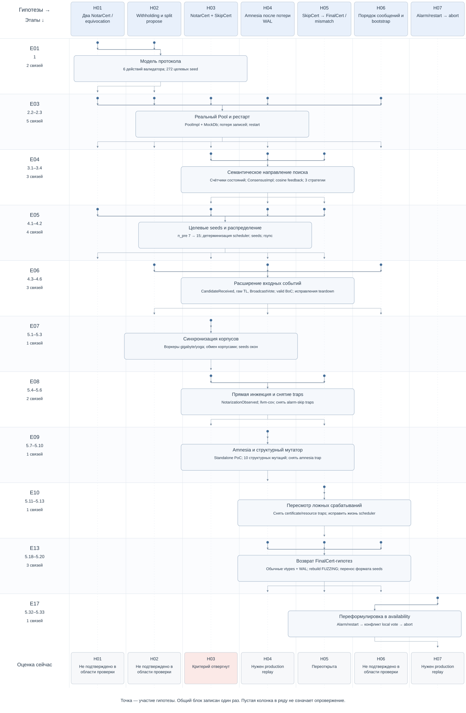

# Гипотезы × этапы

Исследование посвящено поиску уязвимостей византийского консенсуса TON Simplex и связанных сетевых компонентов. Практический вопрос: может ли злоумышленник нарушить согласованность решений валидаторов, остановить подтверждение блоков или истощить ресурсы узла — и тем самым повлиять на надёжность обработки транзакций.

Гипотезы проверялись фаззингом моделей и компонентов реализации, изменением порядка и содержимого сообщений, сценариями перезапуска и восстановления состояния, а также анализом кода. Диаграмма показывает, как предположения превращались в эксперименты, уточнялись по результатам и приводили к следующим проверкам. Статусы отражают полученные свидетельства и открытые вопросы; наличие гипотезы на карте не означает подтверждённую уязвимость.

[Интерактивная матрица — скачать HTML и открыть в браузере](matrix.html) · [Все 18 гипотез, SVG](matrix.svg) · [Консенсус, SVG](matrix-consensus.svg)

**По вертикали идут этапы, по горизонтали стоят колонки гипотез.**
Каждый общий этап показан одним блоком. Стрелки от связанных с ним колонок
сходятся к этому блоку и затем возвращаются в свои колонки.



В HTML закреплены заголовки строк и колонок, доступны фильтры групп.
Нажатие на этап открывает действие, наблюдение, ограничения и источник;
нажатие на гипотезу — её происхождение, оценку и следующий эксперимент.
Файл автономный: сеть и библиотеки для просмотра не нужны.

Точка означает связь гипотезы с эпизодом: проведённую проверку либо отмеченное
ограничение. Она не утверждает, что все гипотезы проверялись одинаково.
Пустая ячейка означает отсутствие связи в реестре, а не опровержение гипотезы.
Самостоятельный этап E02 виден в режиме «Все» без стрелок: отдельного H-ID
для проверки TL-парсера в реестре нет. H18 возникла при последующем обзоре
кода и не имеет исторических этапов.

Ряды сохраняют группировку исходной карты. E11 объединяет две несмежные фазы
5.8 и 5.14, поэтому это матрица этапов, а не точная календарная шкала.
Последний ряд показывает текущую аналитическую оценку, не персональный вердикт жюри.

Источник данных — [hypotheses.json](hypotheses.json). Связи строк и колонок
определяются полем `history`; события и ссылки на журнал не копируются вручную.
Пересборка всех матричных представлений:

```sh
node graph-docs/research-map/render-matrix.cjs
```

SVG обеспечивает фиксированную геометрию таблицы, HTML — фильтры и просмотр
источников, JSON остаётся общим реестром для agentic loop.
