# TON Simplex: как развивались гипотезы

Карта исследования для портфолио и продолжения работы агентом. Источник — журнал Google Sheets (131 строка Sheet1, также Sheet2/Sheet3) и код на commit `4ee8eb0e`. Чтение выполнено 29 сентября 2026; эксперименты заново не запускались.

**18 семейств гипотез и 17 сгруппированных эпизодов — редакционная структура карты, не число независимых багов или запусков.** Две недели и три машины — контекст автора; полный архив кампании не подтверждён. Персональные вердикты не привязаны к отчётам, поэтому слова «принят» и «ПОДТВЕРЖДЁН» из журнала не трактуются как подтверждение жюри.

[Исходник Mermaid](overview.mmd) · [Реестр для агента](hypotheses.json)

## Матрица: гипотезы × этапы

[Открыть табличную диаграмму](MATRIX.md) · [Все колонки, SVG](matrix.svg) · [Автономная интерактивная версия](matrix.html)

Колонки — гипотезы; ряды — этапы. Общий этап записан один раз со стрелками из связанных колонок.

## Что показывает карта

Гипотезы рождались из аналогий BFT, предполагаемых инвариантов, пробелов покрытия и статического анализа. Плато вело к усложнению стенда; новые срабатывания — к исправлению стенда и пересмотру критериев. Связи «развилось из» являются аналитической реконструкцией, а не доказанным порядком мыслей автора.

Главное различие: **исследуемое свойство → наблюдение → интерпретация → следующий эксперимент**. Воспроизводимость искусственного trap, безопасность модели и реальная уязвимость — разные утверждения.

## Эволюция консенсусных гипотез

Самый выразительный пересмотр: H05 была снята в 5.11 как артефакт, затем переоткрыта в 5.18. H03 имеет другой исход: допустимость Notar+Skip прямо указана в официальных пояснениях. Это не индивидуальный вердикт отчёту: [S-verdicts](https://github.com/ton-blockchain/simplex-docs/blob/main/grading-verdicts.md).

## Разветвление ресурсных гипотез

Порог размера структуры — средство обнаружения интересного состояния. Чтобы утверждать DoS, нужен измеренный эффект в допустимой модели нагрузки.

## Развитие метода

H18 добавлена при этой реконструкции: связанный в CMake мутатор описывает старую грамматику входа, тогда как harness расширен. Это вопрос для проверки совместимости, не новая подтверждённая уязвимость.

## Реестр гипотез

| ID | Гипотеза | Текущая оценка | Эпизоды |
|---|---|---|---|
| [H01](#h01) | Два NotarCert / equivocation | Не подтверждено в проверенной области | E01 → E03 → E05 |
| [H02](#h02) | Withholding и split propose | Не подтверждено в проверенной области | E01 → E03 → E06 |
| [H03](#h03) | NotarCert + SkipCert | Ошибочный критерий safety | E03 → E04 → E05 → E07 → E08 |
| [H04](#h04) | Amnesia после потери WAL | Нужен production replay | E03 → E04 → E05 → E06 → E09 → E13 |
| [H05](#h05) | SkipCert → FinalCert / mismatch | Переоткрыта после пересмотра | E04 → E05 → E08 → E10 → E13 |
| [H06](#h06) | Порядок сообщений и bootstrap | Не подтверждено в проверенной области | E03 → E06 → E13 |
| [H07](#h07) | Alarm/restart → abort | Нужен production replay | E17 |
| [H08](#h08) | Рост candidate map | Воздействие не доказано | E05 → E06 → E10 → E14 |
| [H09](#h09) | Повторные сообщения | Воздействие не доказано | E05 → E07 → E10 |
| [H10](#h10) | WaitForParent queue | Воздействие не доказано | E05 → E06 → E10 → E14 |
| [H11](#h11) | CandidateResolver state_ | Статическая гипотеза | E14 |
| [H12](#h12) | TwoStep amplification | Статическая гипотеза | E15 |
| [H13](#h13) | FEC parts_ growth | Статическая гипотеза | E15 |
| [H14](#h14) | FEC seqno overflow | Статическая гипотеза | E15 |
| [H15](#h15) | Unknown broadcast source | Пересмотрена из-за защит | E14 |
| [H16](#h16) | Соседние гипотезы, закрытые проверками | Не подтверждено в проверенной области | E14 → E16 |
| [H17](#h17) | Дефекты и границы стенда | Артефакты стенда разобраны | E04 → E05 → E06 → E08 → E10 → E11 → E13 |
| [H18](#h18) | Согласованность грамматики мутатор ↔ harness | Новый вопрос к коду | Новый обзор кода |

## Журнал развития метода

Числа ниже — утверждения журнала, не результаты повторного запуска. Coverage разных сборок и наборов feedback нельзя напрямую складывать или сравнивать. Эпизоды сгруппированы по смыслу; E11 объединяет две несмежные фазы.

### E01 · 1 · Модель протокола

**Повод:** Аналогии с BFT и предполагаемые инварианты. **Действие:** 6 действий валидатора; 272 целевых seed.

**Записанное наблюдение:** ~239 млн итераций; trap safety не найден. **Ограничение:** Плато не доказывает корректность модели.

[S-E01 · Sheet1!A3:M4](https://docs.google.com/spreadsheets/d/14VwA6OGZ9A1IStozZS6Y-PO_40Cuq0yAFDgXka5_CHU/edit?gid=0#gid=0&range=A3:M4)

### E02 · 2.1 · TL-десериализация

**Повод:** Отделить ошибки парсера от state machine. **Действие:** 9 TL-типов; libFuzzer.

**Записанное наблюдение:** 1,37 млрд итераций; 0 крашей по журналу. **Ограничение:** Ограничено данным генератором и сборкой.

[S-E02 · Sheet1!A6:M7](https://docs.google.com/spreadsheets/d/14VwA6OGZ9A1IStozZS6Y-PO_40Cuq0yAFDgXka5_CHU/edit?gid=0#gid=0&range=A6:M7)

### E03 · 2.2–2.3 · Реальный Pool и рестарт

**Повод:** Модель не охватывает persistence. **Действие:** PoolImpl + MockDb; потеря записей; restart.

**Записанное наблюдение:** cov 104 → 791 по журналу. **Ограничение:** Подписи отключены; модель потери записей требует обоснования.

[S-E03 · Sheet1!A9:L13](https://docs.google.com/spreadsheets/d/14VwA6OGZ9A1IStozZS6Y-PO_40Cuq0yAFDgXka5_CHU/edit?gid=0#gid=0&range=A9:L13)

### E04 · 3.1–3.4 · Семантическое направление поиска

**Повод:** Плато покрытия. **Действие:** Счётчики состояний; ConsensusImpl; cosine feedback; 3 стратегии.

**Записанное наблюдение:** ft до 3162; крашей 0 по журналу. **Ограничение:** Добавление feedback меняет метрику ft; стратегии не сравнивались контролируемо.

[S-E04 · Sheet1!A15:M25](https://docs.google.com/spreadsheets/d/14VwA6OGZ9A1IStozZS6Y-PO_40Cuq0yAFDgXka5_CHU/edit?gid=0#gid=0&range=A15:M25)

### E05 · 4.1–4.2 · Целевые seeds и распределение

**Повод:** Случайный поиск не достигает окна. **Действие:** n_pre 7 → 15; детерминизация scheduler; seeds; rsync.

**Записанное наблюдение:** Срабатывания alarm-skip, state-div и resource traps. **Ограничение:** Срабатывание искусственного trap не равно дефекту протокола.

[S-E05 · Sheet1!A27:M36](https://docs.google.com/spreadsheets/d/14VwA6OGZ9A1IStozZS6Y-PO_40Cuq0yAFDgXka5_CHU/edit?gid=0#gid=0&range=A27:M36)

### E06 · 4.3–4.6 · Расширение входных событий

**Повод:** Не охвачены propose и local-vote пути. **Действие:** CandidateReceived, raw TL, BroadcastVote; valid BoC; исправления teardown.

**Записанное наблюдение:** Новые пути; часть SEGV признана артефактами. **Ограничение:** Достижимость внутренних событий не доказывает сетевую достижимость.

[S-E06 · Sheet1!A38:M48](https://docs.google.com/spreadsheets/d/14VwA6OGZ9A1IStozZS6Y-PO_40Cuq0yAFDgXka5_CHU/edit?gid=0#gid=0&range=A38:M48)

### E07 · 5.1–5.3 · Синхронизация корпусов

**Повод:** Плато на отдельных машинах. **Действие:** Воркеры gigabyte/yoga; обмен корпусами; seeds окон.

**Записанное наблюдение:** Машины выходят на плато; новые целевые входы. **Ограничение:** Третья машина упомянута позднее; полного архива трёх машин нет.

[S-E07 · Sheet1!A50:M57](https://docs.google.com/spreadsheets/d/14VwA6OGZ9A1IStozZS6Y-PO_40Cuq0yAFDgXka5_CHU/edit?gid=0#gid=0&range=A50:M57)

### E08 · 5.4–5.6 · Прямая инжекция и снятие traps

**Повод:** Почти каждый вход завершает прогон. **Действие:** NotarizationObserved; llvm-cov; снять alarm-skip traps.

**Записанное наблюдение:** После снятия trap появились следующие пути. **Ограничение:** Удаление детектора не исправляет исследуемую систему.

[S-E08 · Sheet1!A59:B66](https://docs.google.com/spreadsheets/d/14VwA6OGZ9A1IStozZS6Y-PO_40Cuq0yAFDgXka5_CHU/edit?gid=0#gid=0&range=A59:B66)

### E09 · 5.7–5.10 · Amnesia и структурный мутатор

**Повод:** Нужно повторное голосование после restart. **Действие:** Standalone PoC; 10 структурных мутаций; снять amnesia trap.

**Записанное наблюдение:** Повторное голосование заявлено в журнале; мутатор вновь даёт ~99% крашей. **Ограничение:** Нужна допустимая модель отказов и replay реальной ноды.

[S-E09 · Sheet1!A68:G78](https://docs.google.com/spreadsheets/d/14VwA6OGZ9A1IStozZS6Y-PO_40Cuq0yAFDgXka5_CHU/edit?gid=0#gid=0&range=A68:G78)

### E10 · 5.11–5.13 · Пересмотр ложных срабатываний

**Повод:** Прямая инжекция и teardown доминируют. **Действие:** Снять certificate/resource traps; исправить жизнь scheduler.

**Записанное наблюдение:** Crash rate до 0% по журналу. **Ограничение:** Часть классификации certificate traps позднее пересмотрена.

[S-E10 · Sheet1!A80:B87](https://docs.google.com/spreadsheets/d/14VwA6OGZ9A1IStozZS6Y-PO_40Cuq0yAFDgXka5_CHU/edit?gid=0#gid=0&range=A80:B87)

### E11 · 5.8; 5.14 · Проверки санитайзерами

**Повод:** Отделить memory/UB ошибки от trap. **Действие:** UBSan replay 2700 входов; MSan replay 1351 входа.

**Записанное наблюдение:** UBSan: 0 UB; MSan: неполная инструментализация TDLib. **Ограничение:** Это не доказательство отсутствия UB; MSan-вывод ограничен сборкой.

[S-E11 · Sheet1!A71:B90](https://docs.google.com/spreadsheets/d/14VwA6OGZ9A1IStozZS6Y-PO_40Cuq0yAFDgXka5_CHU/edit?gid=0#gid=0&range=A71:B90)

### E12 · 5.15–5.17 · Feedback-мутатор и merge

**Повод:** Использовать семантическое состояние для мутации. **Действие:** g_last_sim; threshold 0.35; merge корпусов; N=7.

**Записанное наблюдение:** В журнале merge 15955 входов; machine3 выключена. **Ограничение:** Число merged-входов не равно независимым экспериментам.

[S-E12 · Sheet1!A92:B95](https://docs.google.com/spreadsheets/d/14VwA6OGZ9A1IStozZS6Y-PO_40Cuq0yAFDgXka5_CHU/edit?gid=0#gid=0&range=A92:B95)

### E13 · 5.18–5.20 · Возврат FinalCert-гипотез

**Повод:** Новые production CHECK после раннего отклонения. **Действие:** Обычные vtypes + WAL; rebuild FUZZING; перенос формата seeds.

**Записанное наблюдение:** Заявлены skip-finalize и mismatch; минимальные входы 30 байт. **Ограничение:** Отказ ноды заявлен; допустимость сформированного сертификата ещё надо доказать.

[S-E13 · Sheet1!A97:M105](https://docs.google.com/spreadsheets/d/14VwA6OGZ9A1IStozZS6Y-PO_40Cuq0yAFDgXka5_CHU/edit?gid=0#gid=0&range=A97:M105)

### E14 · 5.21–5.25 · Статический анализ и отсев

**Повод:** Искать пробелы вне динамического покрытия. **Действие:** CodeQL; Joern; call paths; state lifecycle.

**Записанное наблюдение:** CandidateResolver state_ выделен; несколько гипотез сняты. **Ограничение:** В CodeQL обнаружен пробел target coverage; статический путь не равен exploit.

[S-E14 · Sheet1!A106:M115](https://docs.google.com/spreadsheets/d/14VwA6OGZ9A1IStozZS6Y-PO_40Cuq0yAFDgXka5_CHU/edit?gid=0#gid=0&range=A106:M115)

### E15 · 5.26–5.29 · Расширение на overlay/FEC

**Повод:** Обобщение resource-growth гипотез. **Действие:** Порядок dedup/rebroadcast; parts_; seqno overflow.

**Записанное наблюдение:** Подготовлены отчёты о росте памяти и amplification. **Ограничение:** Runtime DoS и прохождение входных проверок не подтверждены здесь.

[S-E15 · Sheet1!A116:J123](https://docs.google.com/spreadsheets/d/14VwA6OGZ9A1IStozZS6Y-PO_40Cuq0yAFDgXka5_CHU/edit?gid=0#gid=0&range=A116:J123)

### E16 · после 5.29; 5.31 · Отрицательные результаты overlay

**Повод:** Проверить соседние компоненты. **Действие:** BroadcastSimple cap/GC; ограничение размера ADNL.

**Записанное наблюдение:** Гипотезы закрыты автором журнала. **Ограничение:** В строке 124 стоит 5.3; номер 5.30 не достраивается как факт.

[S-E16 · Sheet1!I124:J127](https://docs.google.com/spreadsheets/d/14VwA6OGZ9A1IStozZS6Y-PO_40Cuq0yAFDgXka5_CHU/edit?gid=0#gid=0&range=I124:J127)

### E17 · 5.32–5.33 · Переформулировка в availability

**Повод:** Попытка показать наблюдаемый crash вместо спорного safety. **Действие:** Alarm/restart → конфликт local vote → abort.

**Записанное наблюдение:** В журнале заявлен детерминированный crash loop. **Ограничение:** Индивидуальный вердикт и независимый replay отсутствуют.

[S-E17 · Sheet1!I128:J131](https://docs.google.com/spreadsheets/d/14VwA6OGZ9A1IStozZS6Y-PO_40Cuq0yAFDgXka5_CHU/edit?gid=0#gid=0&range=I128:J131)

## Карточки гипотез

### H01 · Два NotarCert / equivocation

- **Откуда:** Аналогии BFT; конфликтующие голоса.
- **Проверяемое утверждение:** Двойное голосование приводит к конфликтующим сертификатам.
- **Развитие:** E01 / 1 → E03 / 2.2–2.3 → E05 / 4.1–4.2.
- **Оценка сейчас:** Не подтверждено в проверенной области. В журнале закрыто через will_be_notarized guard. Поведение Byzantine-узла само по себе не нарушение safety.
- **Следующее действие:** Проверить формальный инвариант и предел Byzantine-веса; не переносить вывод на все расписания.

[S-origins · Sheet2!B2:R6](https://docs.google.com/spreadsheets/d/14VwA6OGZ9A1IStozZS6Y-PO_40Cuq0yAFDgXka5_CHU/edit?gid=1323377909#gid=1323377909&range=B2:R6) · [S-E01 · Sheet1!A3:M4](https://docs.google.com/spreadsheets/d/14VwA6OGZ9A1IStozZS6Y-PO_40Cuq0yAFDgXka5_CHU/edit?gid=0#gid=0&range=A3:M4) · [S-E03 · Sheet1!A9:L13](https://docs.google.com/spreadsheets/d/14VwA6OGZ9A1IStozZS6Y-PO_40Cuq0yAFDgXka5_CHU/edit?gid=0#gid=0&range=A9:L13) · [S-E05 · Sheet1!A27:M36](https://docs.google.com/spreadsheets/d/14VwA6OGZ9A1IStozZS6Y-PO_40Cuq0yAFDgXka5_CHU/edit?gid=0#gid=0&range=A27:M36) · [C-model · simulation/fuzz_harness.cpp:1](https://github.com/a1oleg/tonGraph/blob/4ee8eb0e/simulation/fuzz_harness.cpp#L1) · [C-pool · test/consensus/fuzz_pool.cpp:1](https://github.com/a1oleg/tonGraph/blob/4ee8eb0e/test/consensus/fuzz_pool.cpp#L1)

### H02 · Withholding и split propose

- **Откуда:** Модель злонамеренного лидера.
- **Проверяемое утверждение:** Отсутствие/разделение proposal блокирует прогресс.
- **Развитие:** E01 / 1 → E03 / 2.2–2.3 → E06 / 4.3–4.6.
- **Оценка сейчас:** Не подтверждено в проверенной области. В модели не найдено заявленного нарушения; пропущенное окно злонамеренного лидера допустимо.
- **Следующее действие:** Проверять восстановление прогресса после стабилизации сети, а не факт skip.

[S-origins · Sheet2!B2:R6](https://docs.google.com/spreadsheets/d/14VwA6OGZ9A1IStozZS6Y-PO_40Cuq0yAFDgXka5_CHU/edit?gid=1323377909#gid=1323377909&range=B2:R6) · [S-E01 · Sheet1!A3:M4](https://docs.google.com/spreadsheets/d/14VwA6OGZ9A1IStozZS6Y-PO_40Cuq0yAFDgXka5_CHU/edit?gid=0#gid=0&range=A3:M4) · [S-E03 · Sheet1!A9:L13](https://docs.google.com/spreadsheets/d/14VwA6OGZ9A1IStozZS6Y-PO_40Cuq0yAFDgXka5_CHU/edit?gid=0#gid=0&range=A9:L13) · [S-E06 · Sheet1!A38:M48](https://docs.google.com/spreadsheets/d/14VwA6OGZ9A1IStozZS6Y-PO_40Cuq0yAFDgXka5_CHU/edit?gid=0#gid=0&range=A38:M48) · [S-verdicts](https://github.com/ton-blockchain/simplex-docs/blob/main/grading-verdicts.md)

### H03 · NotarCert + SkipCert

- **Откуда:** Ошибочно выбранный safety-инвариант.
- **Проверяемое утверждение:** Два типа сертификата на одном слоте означают нарушение safety.
- **Развитие:** E03 / 2.2–2.3 → E04 / 3.1–3.4 → E05 / 4.1–4.2 → E07 / 5.1–5.3 → E08 / 5.4–5.6.
- **Оценка сейчас:** Ошибочный критерий safety. Пояснения TON прямо допускают это сочетание. Достижение trap не подтверждает safety bug.
- **Следующее действие:** Заменить критерий на конфликт финализированных решений при допустимой модели.

[S-origins · Sheet2!B2:R6](https://docs.google.com/spreadsheets/d/14VwA6OGZ9A1IStozZS6Y-PO_40Cuq0yAFDgXka5_CHU/edit?gid=1323377909#gid=1323377909&range=B2:R6) · [S-E03 · Sheet1!A9:L13](https://docs.google.com/spreadsheets/d/14VwA6OGZ9A1IStozZS6Y-PO_40Cuq0yAFDgXka5_CHU/edit?gid=0#gid=0&range=A9:L13) · [S-E04 · Sheet1!A15:M25](https://docs.google.com/spreadsheets/d/14VwA6OGZ9A1IStozZS6Y-PO_40Cuq0yAFDgXka5_CHU/edit?gid=0#gid=0&range=A15:M25) · [S-E05 · Sheet1!A27:M36](https://docs.google.com/spreadsheets/d/14VwA6OGZ9A1IStozZS6Y-PO_40Cuq0yAFDgXka5_CHU/edit?gid=0#gid=0&range=A27:M36) · [S-E07 · Sheet1!A50:M57](https://docs.google.com/spreadsheets/d/14VwA6OGZ9A1IStozZS6Y-PO_40Cuq0yAFDgXka5_CHU/edit?gid=0#gid=0&range=A50:M57) · [S-E08 · Sheet1!A59:B66](https://docs.google.com/spreadsheets/d/14VwA6OGZ9A1IStozZS6Y-PO_40Cuq0yAFDgXka5_CHU/edit?gid=0#gid=0&range=A59:B66) · [C-pool · test/consensus/fuzz_pool.cpp:1](https://github.com/a1oleg/tonGraph/blob/4ee8eb0e/test/consensus/fuzz_pool.cpp#L1) · [S-verdicts](https://github.com/ton-blockchain/simplex-docs/blob/main/grading-verdicts.md)

### H04 · Amnesia после потери WAL

- **Откуда:** Расширение модели на persistence.
- **Проверяемое утверждение:** Утрата сохранённого голоса позволяет повторно голосовать за другой блок.
- **Развитие:** E03 / 2.2–2.3 → E04 / 3.1–3.4 → E05 / 4.1–4.2 → E06 / 4.3–4.6 → E09 / 5.7–5.10 → E13 / 5.18–5.20.
- **Оценка сейчас:** Нужен production replay. Журнал содержит PoC, затем ограничение ResolveState, затем повторное подтверждение. Тест использует MockDb.
- **Следующее действие:** Зафиксировать семантику durability и воспроизвести допустимый crash до persist на реальной ноде.

[S-origins · Sheet2!B2:R6](https://docs.google.com/spreadsheets/d/14VwA6OGZ9A1IStozZS6Y-PO_40Cuq0yAFDgXka5_CHU/edit?gid=1323377909#gid=1323377909&range=B2:R6) · [S-E03 · Sheet1!A9:L13](https://docs.google.com/spreadsheets/d/14VwA6OGZ9A1IStozZS6Y-PO_40Cuq0yAFDgXka5_CHU/edit?gid=0#gid=0&range=A9:L13) · [S-E05 · Sheet1!A27:M36](https://docs.google.com/spreadsheets/d/14VwA6OGZ9A1IStozZS6Y-PO_40Cuq0yAFDgXka5_CHU/edit?gid=0#gid=0&range=A27:M36) · [S-E06 · Sheet1!A38:M48](https://docs.google.com/spreadsheets/d/14VwA6OGZ9A1IStozZS6Y-PO_40Cuq0yAFDgXka5_CHU/edit?gid=0#gid=0&range=A38:M48) · [S-E09 · Sheet1!A68:G78](https://docs.google.com/spreadsheets/d/14VwA6OGZ9A1IStozZS6Y-PO_40Cuq0yAFDgXka5_CHU/edit?gid=0#gid=0&range=A68:G78) · [S-E13 · Sheet1!A97:M105](https://docs.google.com/spreadsheets/d/14VwA6OGZ9A1IStozZS6Y-PO_40Cuq0yAFDgXka5_CHU/edit?gid=0#gid=0&range=A97:M105) · [C-amnesia · test/consensus/test_amnesia_poc.cpp:1](https://github.com/a1oleg/tonGraph/blob/4ee8eb0e/test/consensus/test_amnesia_poc.cpp#L1) · [C-db · validator/consensus/simplex/db.cpp:74](https://github.com/a1oleg/tonGraph/blob/4ee8eb0e/validator/consensus/simplex/db.cpp#L74) · [S-verdicts](https://github.com/ton-blockchain/simplex-docs/blob/main/grading-verdicts.md) · [S-E04 · Sheet1!A15:M25](https://docs.google.com/spreadsheets/d/14VwA6OGZ9A1IStozZS6Y-PO_40Cuq0yAFDgXka5_CHU/edit?gid=0#gid=0&range=A15:M25)

### H05 · SkipCert → FinalCert / mismatch

- **Откуда:** Развитие гипотезы state divergence.
- **Проверяемое утверждение:** Обработка конфликтующего FinalCert вызывает CHECK или нарушение согласованности.
- **Развитие:** E04 / 3.1–3.4 → E05 / 4.1–4.2 → E08 / 5.4–5.6 → E10 / 5.11–5.13 → E13 / 5.18–5.20.
- **Оценка сейчас:** Переоткрыта после пересмотра. В 5.11 снято как артефакт прямой инжекции; в 5.18 возвращено на основании иных путей. Это не подтверждение финализированного fork.
- **Следующее действие:** Проверить допустимость сертификатов, Byzantine-вес, n_lose и точную версию формата seed.

[S-origins · Sheet2!B2:R6](https://docs.google.com/spreadsheets/d/14VwA6OGZ9A1IStozZS6Y-PO_40Cuq0yAFDgXka5_CHU/edit?gid=1323377909#gid=1323377909&range=B2:R6) · [S-E05 · Sheet1!A27:M36](https://docs.google.com/spreadsheets/d/14VwA6OGZ9A1IStozZS6Y-PO_40Cuq0yAFDgXka5_CHU/edit?gid=0#gid=0&range=A27:M36) · [S-E08 · Sheet1!A59:B66](https://docs.google.com/spreadsheets/d/14VwA6OGZ9A1IStozZS6Y-PO_40Cuq0yAFDgXka5_CHU/edit?gid=0#gid=0&range=A59:B66) · [S-E10 · Sheet1!A80:B87](https://docs.google.com/spreadsheets/d/14VwA6OGZ9A1IStozZS6Y-PO_40Cuq0yAFDgXka5_CHU/edit?gid=0#gid=0&range=A80:B87) · [S-E13 · Sheet1!A97:M105](https://docs.google.com/spreadsheets/d/14VwA6OGZ9A1IStozZS6Y-PO_40Cuq0yAFDgXka5_CHU/edit?gid=0#gid=0&range=A97:M105) · [C-cert · test/consensus/fuzz_pool.cpp:557](https://github.com/a1oleg/tonGraph/blob/4ee8eb0e/test/consensus/fuzz_pool.cpp#L557) · [S-E04 · Sheet1!A15:M25](https://docs.google.com/spreadsheets/d/14VwA6OGZ9A1IStozZS6Y-PO_40Cuq0yAFDgXka5_CHU/edit?gid=0#gid=0&range=A15:M25)

### H06 · Порядок сообщений и bootstrap

- **Откуда:** Out-of-order и tolerate_conflicts.
- **Проверяемое утверждение:** Переупорядочение нарушает восстановление или скрывает конфликт.
- **Развитие:** E03 / 2.2–2.3 → E06 / 4.3–4.6 → E13 / 5.18–5.20.
- **Оценка сейчас:** Не подтверждено в проверенной области. В строке 103 исследование объявлено завершённым без подтверждения; текущий код содержит перестановки.
- **Следующее действие:** Отдельно учитывать порядок доставки и допустимость самих голосов.

[S-origins · Sheet2!B2:R6](https://docs.google.com/spreadsheets/d/14VwA6OGZ9A1IStozZS6Y-PO_40Cuq0yAFDgXka5_CHU/edit?gid=1323377909#gid=1323377909&range=B2:R6) · [S-E03 · Sheet1!A9:L13](https://docs.google.com/spreadsheets/d/14VwA6OGZ9A1IStozZS6Y-PO_40Cuq0yAFDgXka5_CHU/edit?gid=0#gid=0&range=A9:L13) · [S-E06 · Sheet1!A38:M48](https://docs.google.com/spreadsheets/d/14VwA6OGZ9A1IStozZS6Y-PO_40Cuq0yAFDgXka5_CHU/edit?gid=0#gid=0&range=A38:M48) · [S-E13 · Sheet1!A97:M105](https://docs.google.com/spreadsheets/d/14VwA6OGZ9A1IStozZS6Y-PO_40Cuq0yAFDgXka5_CHU/edit?gid=0#gid=0&range=A97:M105) · [C-format · test/consensus/fuzz_pool.cpp:1350](https://github.com/a1oleg/tonGraph/blob/4ee8eb0e/test/consensus/fuzz_pool.cpp#L1350) · [S-reorder · Sheet1!L103](https://docs.google.com/spreadsheets/d/14VwA6OGZ9A1IStozZS6Y-PO_40Cuq0yAFDgXka5_CHU/edit?gid=0#gid=0&range=L103)

### H07 · Alarm/restart → abort

- **Откуда:** Переформулировка H03 в availability.
- **Проверяемое утверждение:** Локальный SkipVote после NotarizeVote вызывает crash loop.
- **Развитие:** E17 / 5.32–5.33.
- **Оценка сейчас:** Нужен production replay. Журнал заявляет crash, но допустимость Notar+Skip опровергает исходное объяснение конфликта; нужен разбор точного CHECK.
- **Следующее действие:** Воспроизвести немодифицированную сборку, исключить поддельный local vote и конфликт иной пары голосов.

[S-origins · Sheet2!B2:R6](https://docs.google.com/spreadsheets/d/14VwA6OGZ9A1IStozZS6Y-PO_40Cuq0yAFDgXka5_CHU/edit?gid=1323377909#gid=1323377909&range=B2:R6) · [S-E17 · Sheet1!I128:J131](https://docs.google.com/spreadsheets/d/14VwA6OGZ9A1IStozZS6Y-PO_40Cuq0yAFDgXka5_CHU/edit?gid=0#gid=0&range=I128:J131) · [C-pool · test/consensus/fuzz_pool.cpp:1](https://github.com/a1oleg/tonGraph/blob/4ee8eb0e/test/consensus/fuzz_pool.cpp#L1) · [S-verdicts](https://github.com/ton-blockchain/simplex-docs/blob/main/grading-verdicts.md)

### H08 · Рост candidate map

- **Откуда:** Сложность обработки разных candidateId.
- **Проверяемое утверждение:** Рост notarize_weight вызывает superlinear DoS.
- **Развитие:** E05 / 4.1–4.2 → E06 / 4.3–4.6 → E10 / 5.11–5.13 → E14 / 5.21–5.25.
- **Оценка сейчас:** Воздействие не доказано. Три записи и искусственный порог доказывают только достижение размера map.
- **Следующее действие:** Измерить память/CPU по времени при ограниченном атакующем; проверить upstream bounds.

[S-origins · Sheet2!B2:R6](https://docs.google.com/spreadsheets/d/14VwA6OGZ9A1IStozZS6Y-PO_40Cuq0yAFDgXka5_CHU/edit?gid=1323377909#gid=1323377909&range=B2:R6) · [S-E05 · Sheet1!A27:M36](https://docs.google.com/spreadsheets/d/14VwA6OGZ9A1IStozZS6Y-PO_40Cuq0yAFDgXka5_CHU/edit?gid=0#gid=0&range=A27:M36) · [S-E06 · Sheet1!A38:M48](https://docs.google.com/spreadsheets/d/14VwA6OGZ9A1IStozZS6Y-PO_40Cuq0yAFDgXka5_CHU/edit?gid=0#gid=0&range=A38:M48) · [S-E10 · Sheet1!A80:B87](https://docs.google.com/spreadsheets/d/14VwA6OGZ9A1IStozZS6Y-PO_40Cuq0yAFDgXka5_CHU/edit?gid=0#gid=0&range=A80:B87) · [S-E14 · Sheet1!A106:M115](https://docs.google.com/spreadsheets/d/14VwA6OGZ9A1IStozZS6Y-PO_40Cuq0yAFDgXka5_CHU/edit?gid=0#gid=0&range=A106:M115) · [C-resource · validator/consensus/simplex/pool.cpp:434](https://github.com/a1oleg/tonGraph/blob/4ee8eb0e/validator/consensus/simplex/pool.cpp#L434)

### H09 · Повторные сообщения

- **Откуда:** Обобщение flood-сценариев.
- **Проверяемое утверждение:** Дубли голосов перегружают узел.
- **Развитие:** E05 / 4.1–4.2 → E07 / 5.1–5.3 → E10 / 5.11–5.13.
- **Оценка сейчас:** Воздействие не доказано. Порог >4 сообщений не является доказательством реалистичного DoS.
- **Следующее действие:** Измерить стоимость дубля, throughput и деградацию прогресса.

[S-origins · Sheet2!B2:R6](https://docs.google.com/spreadsheets/d/14VwA6OGZ9A1IStozZS6Y-PO_40Cuq0yAFDgXka5_CHU/edit?gid=1323377909#gid=1323377909&range=B2:R6) · [S-E05 · Sheet1!A27:M36](https://docs.google.com/spreadsheets/d/14VwA6OGZ9A1IStozZS6Y-PO_40Cuq0yAFDgXka5_CHU/edit?gid=0#gid=0&range=A27:M36) · [S-E07 · Sheet1!A50:M57](https://docs.google.com/spreadsheets/d/14VwA6OGZ9A1IStozZS6Y-PO_40Cuq0yAFDgXka5_CHU/edit?gid=0#gid=0&range=A50:M57) · [S-E10 · Sheet1!A80:B87](https://docs.google.com/spreadsheets/d/14VwA6OGZ9A1IStozZS6Y-PO_40Cuq0yAFDgXka5_CHU/edit?gid=0#gid=0&range=A80:B87) · [C-resource · validator/consensus/simplex/pool.cpp:434](https://github.com/a1oleg/tonGraph/blob/4ee8eb0e/validator/consensus/simplex/pool.cpp#L434)

### H10 · WaitForParent queue

- **Откуда:** Неразрешённые зависимости кандидатов.
- **Проверяемое утверждение:** Очередь ожиданий растёт и дорого пересматривается.
- **Развитие:** E05 / 4.1–4.2 → E06 / 4.3–4.6 → E10 / 5.11–5.13 → E14 / 5.21–5.25.
- **Оценка сейчас:** Воздействие не доказано. Очередь и teardown раскрыли также ошибки стенда; фиксированный порог не доказывает unbounded growth.
- **Следующее действие:** Проверить lifetime, дедупликацию и рост при достижимой последовательности кандидатов.

[S-origins · Sheet2!B2:R6](https://docs.google.com/spreadsheets/d/14VwA6OGZ9A1IStozZS6Y-PO_40Cuq0yAFDgXka5_CHU/edit?gid=1323377909#gid=1323377909&range=B2:R6) · [S-E05 · Sheet1!A27:M36](https://docs.google.com/spreadsheets/d/14VwA6OGZ9A1IStozZS6Y-PO_40Cuq0yAFDgXka5_CHU/edit?gid=0#gid=0&range=A27:M36) · [S-E06 · Sheet1!A38:M48](https://docs.google.com/spreadsheets/d/14VwA6OGZ9A1IStozZS6Y-PO_40Cuq0yAFDgXka5_CHU/edit?gid=0#gid=0&range=A38:M48) · [S-E10 · Sheet1!A80:B87](https://docs.google.com/spreadsheets/d/14VwA6OGZ9A1IStozZS6Y-PO_40Cuq0yAFDgXka5_CHU/edit?gid=0#gid=0&range=A80:B87) · [S-E14 · Sheet1!A106:M115](https://docs.google.com/spreadsheets/d/14VwA6OGZ9A1IStozZS6Y-PO_40Cuq0yAFDgXka5_CHU/edit?gid=0#gid=0&range=A106:M115) · [C-resource · validator/consensus/simplex/pool.cpp:434](https://github.com/a1oleg/tonGraph/blob/4ee8eb0e/validator/consensus/simplex/pool.cpp#L434) · [S-parent · Sheet1!B118:B119](https://docs.google.com/spreadsheets/d/14VwA6OGZ9A1IStozZS6Y-PO_40Cuq0yAFDgXka5_CHU/edit?gid=0#gid=0&range=B118:B119)

### H11 · CandidateResolver state_

- **Откуда:** Joern: вставки и отсутствие очистки.
- **Проверяемое утверждение:** Состояние кандидатов накапливается в сессии.
- **Развитие:** E14 / 5.21–5.25.
- **Оценка сейчас:** Статическая гипотеза. Журнал выделяет гипотезу после отсева соседних false positives; достижимый DoS здесь не проверен.
- **Следующее действие:** Измерить lifetime сессии, число допустимых ключей и memory/time curve.

[S-origins · Sheet2!B2:R6](https://docs.google.com/spreadsheets/d/14VwA6OGZ9A1IStozZS6Y-PO_40Cuq0yAFDgXka5_CHU/edit?gid=1323377909#gid=1323377909&range=B2:R6) · [S-E14 · Sheet1!A106:M115](https://docs.google.com/spreadsheets/d/14VwA6OGZ9A1IStozZS6Y-PO_40Cuq0yAFDgXka5_CHU/edit?gid=0#gid=0&range=A106:M115) · [C-resolver · validator/consensus/simplex/candidate-resolver.cpp:147](https://github.com/a1oleg/tonGraph/blob/4ee8eb0e/validator/consensus/simplex/candidate-resolver.cpp#L147)

### H12 · TwoStep amplification

- **Откуда:** Перенос resource-гипотезы на overlay.
- **Проверяемое утверждение:** Rebroadcast до dedup размножает повторный трафик.
- **Развитие:** E15 / 5.26–5.29.
- **Оценка сейчас:** Статическая гипотеза. Порядок вызовов виден в коде; сетевой эффект и ограничения требуют эксперимента.
- **Следующее действие:** Replay допустимых дублей на реальном overlay; измерить входящий/исходящий трафик.

[S-origins · Sheet2!B2:R6](https://docs.google.com/spreadsheets/d/14VwA6OGZ9A1IStozZS6Y-PO_40Cuq0yAFDgXka5_CHU/edit?gid=1323377909#gid=1323377909&range=B2:R6) · [S-E15 · Sheet1!A116:J123](https://docs.google.com/spreadsheets/d/14VwA6OGZ9A1IStozZS6Y-PO_40Cuq0yAFDgXka5_CHU/edit?gid=0#gid=0&range=A116:J123) · [C-twostep · overlay/broadcast-twostep.cpp:314](https://github.com/a1oleg/tonGraph/blob/4ee8eb0e/overlay/broadcast-twostep.cpp#L314)

### H13 · FEC parts_ growth

- **Откуда:** Анализ lifecycle буфера.
- **Проверяемое утверждение:** Части broadcast копятся до завершения декодирования.
- **Развитие:** E15 / 5.26–5.29.
- **Оценка сейчас:** Статическая гипотеза. Есть статическая гипотеза и compile-time probe; probe сам меняет состояние, это не сетевой PoC.
- **Следующее действие:** Проверить GC, сроки жизни, ограничения seqno и memory/time curve.

[S-origins · Sheet2!B2:R6](https://docs.google.com/spreadsheets/d/14VwA6OGZ9A1IStozZS6Y-PO_40Cuq0yAFDgXka5_CHU/edit?gid=1323377909#gid=1323377909&range=B2:R6) · [S-E15 · Sheet1!A116:J123](https://docs.google.com/spreadsheets/d/14VwA6OGZ9A1IStozZS6Y-PO_40Cuq0yAFDgXka5_CHU/edit?gid=0#gid=0&range=A116:J123) · [C-fec · overlay/broadcast-fec.cpp:88](https://github.com/a1oleg/tonGraph/blob/4ee8eb0e/overlay/broadcast-fec.cpp#L88)

### H14 · FEC seqno overflow

- **Откуда:** Развитие H13: арифметика dedup.
- **Проверяемое утверждение:** UINT32_MAX обнуляет next_seqno_ и обходится dedup.
- **Развитие:** E15 / 5.26–5.29.
- **Оценка сейчас:** Статическая гипотеза. Арифметический путь отмечен; прохождение всех проверок входного пакета не доказано.
- **Следующее действие:** Проверить входную валидацию и влияние повторов на реальный broadcast.

[S-origins · Sheet2!B2:R6](https://docs.google.com/spreadsheets/d/14VwA6OGZ9A1IStozZS6Y-PO_40Cuq0yAFDgXka5_CHU/edit?gid=1323377909#gid=1323377909&range=B2:R6) · [S-E15 · Sheet1!A116:J123](https://docs.google.com/spreadsheets/d/14VwA6OGZ9A1IStozZS6Y-PO_40Cuq0yAFDgXka5_CHU/edit?gid=0#gid=0&range=A116:J123) · [C-seqno · overlay/broadcast-fec.cpp:183](https://github.com/a1oleg/tonGraph/blob/4ee8eb0e/overlay/broadcast-fec.cpp#L183)

### H15 · Unknown broadcast source

- **Откуда:** Поиск .at() и исключений.
- **Проверяемое утверждение:** Неизвестный источник вызывает out_of_range в private overlay.
- **Развитие:** E14 / 5.21–5.25.
- **Оценка сейчас:** Пересмотрена из-за защит. В 5.21 создан отчёт; в 5.22 тот же класс .at() назван защищённым overlay-слоем.
- **Следующее действие:** Снять противоречие call-path проверкой; до этого не считать багом.

[S-origins · Sheet2!B2:R6](https://docs.google.com/spreadsheets/d/14VwA6OGZ9A1IStozZS6Y-PO_40Cuq0yAFDgXka5_CHU/edit?gid=1323377909#gid=1323377909&range=B2:R6) · [S-E14 · Sheet1!A106:M115](https://docs.google.com/spreadsheets/d/14VwA6OGZ9A1IStozZS6Y-PO_40Cuq0yAFDgXka5_CHU/edit?gid=0#gid=0&range=A106:M115) · [S-at · Sheet1!B106:K109](https://docs.google.com/spreadsheets/d/14VwA6OGZ9A1IStozZS6Y-PO_40Cuq0yAFDgXka5_CHU/edit?gid=0#gid=0&range=B106:K109)

### H16 · Соседние гипотезы, закрытые проверками

- **Откуда:** CodeQL/Joern и ручной разбор.
- **Проверяемое утверждение:** optional, ссылки, вес сертификата, shutdown, block accepter, peer flood.
- **Развитие:** E14 / 5.21–5.25 → E16 / после 5.29; 5.31.
- **Оценка сейчас:** Не подтверждено в проверенной области. Журнал фиксирует защиту порядком записи, lifetime, quorum check, caps/GC и ADNL limit; shutdown понижен до operational.
- **Следующее действие:** Сохранить причины закрытия и область применимости; переоткрывать только при изменении условий.

[S-origins · Sheet2!B2:R6](https://docs.google.com/spreadsheets/d/14VwA6OGZ9A1IStozZS6Y-PO_40Cuq0yAFDgXka5_CHU/edit?gid=1323377909#gid=1323377909&range=B2:R6) · [S-E14 · Sheet1!A106:M115](https://docs.google.com/spreadsheets/d/14VwA6OGZ9A1IStozZS6Y-PO_40Cuq0yAFDgXka5_CHU/edit?gid=0#gid=0&range=A106:M115) · [S-E16 · Sheet1!I124:J127](https://docs.google.com/spreadsheets/d/14VwA6OGZ9A1IStozZS6Y-PO_40Cuq0yAFDgXka5_CHU/edit?gid=0#gid=0&range=I124:J127)

### H17 · Дефекты и границы стенда

- **Откуда:** Невоспроизводимость и доминирующие crashes.
- **Проверяемое утверждение:** Часть срабатываний создаётся генератором, scheduler или конфигурацией сборки.
- **Развитие:** E04 / 3.1–3.4 → E05 / 4.1–4.2 → E06 / 4.3–4.6 → E08 / 5.4–5.6 → E10 / 5.11–5.13 → E11 / 5.8; 5.14 → E13 / 5.18–5.20.
- **Оценка сейчас:** Артефакты стенда разобраны. Документированы недетерминизм, teardown, invalid BoC, отключённые macro, неполный MSan и дрейф seed format.
- **Следующее действие:** Отдельный набор тестов стенда: isolation, replay determinism, допустимость событий, build provenance.

[S-origins · Sheet2!B2:R6](https://docs.google.com/spreadsheets/d/14VwA6OGZ9A1IStozZS6Y-PO_40Cuq0yAFDgXka5_CHU/edit?gid=1323377909#gid=1323377909&range=B2:R6) · [S-E05 · Sheet1!A27:M36](https://docs.google.com/spreadsheets/d/14VwA6OGZ9A1IStozZS6Y-PO_40Cuq0yAFDgXka5_CHU/edit?gid=0#gid=0&range=A27:M36) · [S-E06 · Sheet1!A38:M48](https://docs.google.com/spreadsheets/d/14VwA6OGZ9A1IStozZS6Y-PO_40Cuq0yAFDgXka5_CHU/edit?gid=0#gid=0&range=A38:M48) · [S-E08 · Sheet1!A59:B66](https://docs.google.com/spreadsheets/d/14VwA6OGZ9A1IStozZS6Y-PO_40Cuq0yAFDgXka5_CHU/edit?gid=0#gid=0&range=A59:B66) · [S-E10 · Sheet1!A80:B87](https://docs.google.com/spreadsheets/d/14VwA6OGZ9A1IStozZS6Y-PO_40Cuq0yAFDgXka5_CHU/edit?gid=0#gid=0&range=A80:B87) · [S-E11 · Sheet1!A71:B90](https://docs.google.com/spreadsheets/d/14VwA6OGZ9A1IStozZS6Y-PO_40Cuq0yAFDgXka5_CHU/edit?gid=0#gid=0&range=A71:B90) · [S-E13 · Sheet1!A97:M105](https://docs.google.com/spreadsheets/d/14VwA6OGZ9A1IStozZS6Y-PO_40Cuq0yAFDgXka5_CHU/edit?gid=0#gid=0&range=A97:M105) · [C-pool · test/consensus/fuzz_pool.cpp:1](https://github.com/a1oleg/tonGraph/blob/4ee8eb0e/test/consensus/fuzz_pool.cpp#L1) · [C-cmake · test/consensus/CMakeLists.txt:40](https://github.com/a1oleg/tonGraph/blob/4ee8eb0e/test/consensus/CMakeLists.txt#L40) · [S-E04 · Sheet1!A15:M25](https://docs.google.com/spreadsheets/d/14VwA6OGZ9A1IStozZS6Y-PO_40Cuq0yAFDgXka5_CHU/edit?gid=0#gid=0&range=A15:M25)

### H18 · Согласованность грамматики мутатор ↔ harness

- **Откуда:** Повторное чтение текущего кода.
- **Проверяемое утверждение:** Мутатор описывает 4-byte header / vtype<=7, harness читает расширенный control layout / vtype<=15.
- **Развитие:** Новое наблюдение при реконструкции.
- **Оценка сейчас:** Новый вопрос к коду. Это новое наблюдение при построении карты, а не находка двухнедельной кампании. CMake связывает оба файла. Семантическая совместимость требует проверки.
- **Следующее действие:** Сравнить decode/encode с FuzzedDataProvider; выполнить round-trip и replay известных seeds.

[S-origins · Sheet2!B2:R6](https://docs.google.com/spreadsheets/d/14VwA6OGZ9A1IStozZS6Y-PO_40Cuq0yAFDgXka5_CHU/edit?gid=1323377909#gid=1323377909&range=B2:R6) · [C-mutator · test/consensus/fuzz_pool_mutator.cpp:44](https://github.com/a1oleg/tonGraph/blob/4ee8eb0e/test/consensus/fuzz_pool_mutator.cpp#L44) · [C-format · test/consensus/fuzz_pool.cpp:1350](https://github.com/a1oleg/tonGraph/blob/4ee8eb0e/test/consensus/fuzz_pool.cpp#L1350) · [C-cmake · test/consensus/CMakeLists.txt:40](https://github.com/a1oleg/tonGraph/blob/4ee8eb0e/test/consensus/CMakeLists.txt#L40)

## Использование в agentic loop

Это **предлагаемый порядок дальнейшей работы**, а не утверждение, что исторические эксперименты выполнялись автономным агентом.

1. Единственный редактируемый реестр — `hypotheses.json`; ID гипотез сохраняются.
2. К каждому новому наблюдению добавляются источник, уровень доказательности и версия кода. Результаты экспериментов остаются в OneDrive; в Git — ссылки и хеши.
3. Историю решений дополнять, а не переписывать. Переоткрытие требует нового свидетельства.
4. Не присваивать статус подтверждённого дефекта на основании текста журнала, номера trap или роста покрытия.
5. Выполнить `node graph-docs/research-map/render.cjs`: проверка ссылочной целостности и обновление Mermaid/README.
6. Для обновления SVG использовать Mermaid CLI 11.12.0: `mmdc -i overview.mmd -o overview.svg -b white` и аналогично для остальных четырёх диаграмм. Для уже экспортированных SVG зависимости не требуются.

## Формулировка для резюме

«Разработал и итеративно расширял стенд фаззинга TON Simplex: модель протокола, реальный actor runtime, crash/restart-сценарии, семантическую обратную связь и структурные мутации. Организовал распределённые прогоны и анализ корпусов, исследовал причины ложных срабатываний, применял санитайзеры и статический анализ. Систематизировал происхождение гипотез, результаты проверок и причины пересмотра в воспроизводимом реестре».

Эта формулировка описывает выполненную инженерную работу и не заявляет принятые уязвимости.
